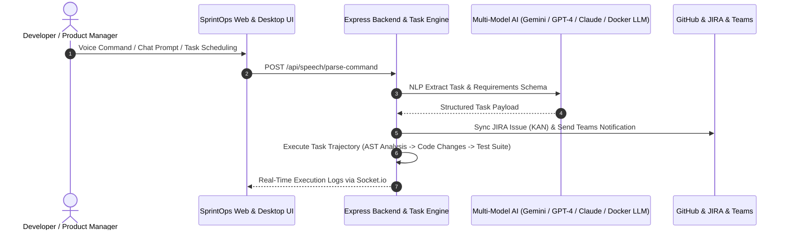
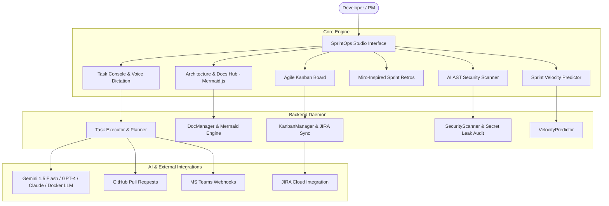

# SprintOps 🚀
> **Autonomous Agile Platform & AI Development Copilot**

SprintOps is an enterprise-grade autonomous agile platform that bridges voice dictation, AI task planning, automated code execution, JIRA ticket status synchronization, GitHub PR management, and Miro-style retrospectives.

---

## 🌟 Architecture & System Sequence Diagram



---

## 📐 System Component Diagram



---

## ✨ Key Features

### 1. 📐 Architecture & Docs Hub (Mermaid.js)
- **Live Sequence Diagrams:** Interactive rendering of system sequence diagrams, flowcharts, ER diagrams, and class maps using `mermaid.js`.
- **AI Mermaid Generator:** Describe any software flow in plain text (e.g., *"OAuth 2.0 PKCE authentication flow"*), and SprintOps automatically generates valid Mermaid diagram code.
- **Confluence Specs:** Markdown editing and persistent documentation workspace.

### 2. 📊 Agile Kanban & JIRA Synchronization
- **4-Column Kanban Board:** `Backlog` → `In Progress` → `AI Review` → `Done`.
- **Two-Way JIRA Sync:** Real-time Webhook sync for JIRA tickets, updating card columns dynamically when status transitions occur in JIRA.

### 3. 📝 Miro-Inspired Sprint Retrospectives
- **Sticky Note Columns:** *What Went Well*, *Needs Improvement*, *Action Items*, and *Ideas & Experiments*.
- **AI Retro Insights:** One-click LLM performance summary analyzing completed sprint tasks, throughput, and error rates.
- **Action Item Conversion:** Instant **"Convert to Task"** trigger transforming retro notes into scheduled SprintOps tasks.

### 4. 🛡️ AI AST Code Security Scanner
- **Secret Leak Detection:** Scans workspace files for exposed API keys (`sk-`, `ghp_`, `AKIA`), SQL injections, and dangerous command execution risks.
- **Security Score (0-100%):** Calculates workspace security health grade and provides actionable remediation guidance.

### 5. ⚡ Gemini Antigravity Trajectory Layout
- **Task Trajectories:** Interactive step-by-step checklists (`[x] Codebase AST Analysis`, `[/] Implementation Plan`, `[ ] Verification Test Suite`) for scheduled dev tasks.
- **Directory Picker:** Native OS folder browser for selecting project directories.
- **Raycast Command Palette (`Ctrl+K`):** Global action search overlay to switch views, trigger security audits, or generate diagrams instantly.

---

## 🛠️ Quickstart Guide

### 1. Installation
```bash
git clone https://github.com/hemanthgalam/todo-gpt.git
cd todo-gpt
npm install
```

### 2. Run Desktop App
```bash
npm run desktop
```
*Launches the Electron desktop app and Express backend server at `http://localhost:3000`.*

### 3. Run Automated Tests
```bash
npm test
```

---

## ⚙️ Configuration & Environment Variables

SprintOps supports dynamic configuration overlays saved to `data/config.json` (git-ignored) via the Settings Console in the UI.

| Parameter | Description | Default |
| :--- | :--- | :--- |
| `GEMINI_API_KEY` | Google Gemini API Key | Recommended |
| `OPENAI_API_KEY` | OpenAI API Key | Optional |
| `ANTHROPIC_API_KEY` | Anthropic Claude API Key | Optional |
| `AI_MODEL` | Primary LLM Provider Model | `gemini-1.5-flash` |
| `JIRA_BASE_URL` | JIRA Cloud Domain | `https://domain.atlassian.net` |
| `JIRA_PROJECT_KEY` | JIRA Project Key | `KAN` |
| `TEAMS_WEBHOOK_URL` | MS Teams Power Automate Webhook | Optional |

---

## 📄 License
Distributed under the MIT License. Developed by Hemanth Galam.
